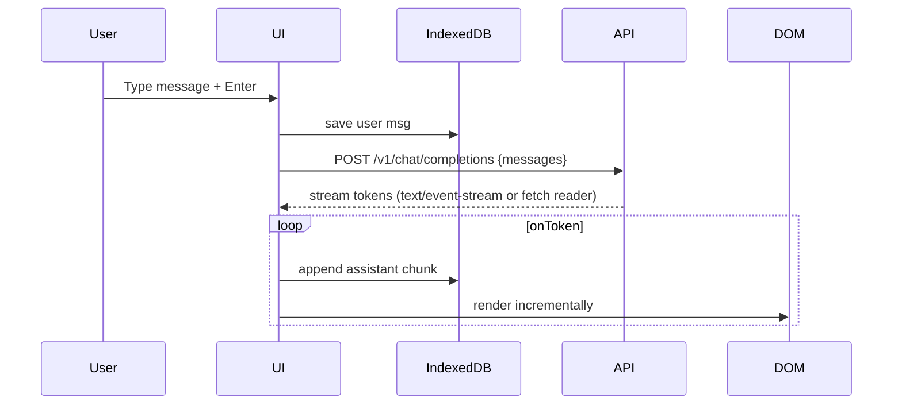

# Slim Technical Design Specification  
**Project**: Chat Prototype – *Browser‑only MVP*  
**Version**: 0.1  
**Goal**: Deliver the **simplest usable prototype**: a purely client‑side web app that:

* Stores all state in the browser (IndexedDB + localStorage).
* Calls any OpenAI‑compatible endpoint—including a local `llama.cpp` HTTP server—via CORS‑enabled fetch.
* Requires **no backend server** and **no external database**.

---

## 1 Architecture Overview

```txt
┌──────────────────────────────────┐
│           React SPA             │
│  • Chat UI (TS + Vite)          │
│  • IndexedDB (Dexie.js)         │
│  • LocalStorage (config)        │
│  • Fetch → OpenAI‑style API     │
└──────────────────────────────────┘
```

No server components. The page can be served statically (GitHub Pages, Vercel, S3, etc.).

---

## 2 Key Libraries

| Purpose            | Library         | Notes                                  |
|--------------------|-----------------|----------------------------------------|
| Framework          | React 18        | SPA with hooks                         |
| Build              | Vite            | `vite build --base ./` for static path |
| State & Async      | React Query     | Query caching for fetch calls          |
| Storage            | Dexie.js        | IndexedDB wrapper for messages         |
| Markdown Render    | Marked          | Render assistant markdown              |
| Styling            | TailwindCSS     | Rapid CSS + dark mode                  |

---

## 3 Data Persistence

| Store       | Tech        | Schema |
|-------------|-------------|--------|
| **Config**  | `localStorage` | Key: `llm_chat_config`, JSON string containing `{backendUrl, apiKey, model, agents[]}` |
| **Messages**| `IndexedDB` (Dexie) | DB `chatDB` → table `messages` with `{id, sessionId, agent, role, content, ts}` |
| **Sessions**| `IndexedDB` | table `sessions` with `{id, startedAt, title}` |

Maximum 50 sessions retained; LRU eviction beyond that.

---

## 4 UI Components

1. **ChatView**  
   * Scrollable message list (virtualized).  
   * Token‑by‑token streaming render (EventSource or custom chunk parser).

2. **MessageInput**  
   * Textarea + **Shift+Enter** newline.  
   * `/slash` command to switch agents (future).

3. **SettingsModal**  
   * Fields: `Backend URL`, `API Key`, `Model`, `Max Tokens`.  
   * Import / Export config (download / file upload).

4. **SessionSidebar**  
   * Create, rename, delete sessions.

---

## 5 Core Flow



---

## 6 LLM Fetch Details

```ts
await fetch(`${backendUrl}/v1/chat/completions`, {
  method: "POST",
  headers: {
    "Content-Type": "application/json",
    "Authorization": `Bearer ${apiKey}`
  },
  body: JSON.stringify({
    model,
    stream: true,
    messages,
    functions // optional
  })
});
```

* Expect `text/event-stream` for streaming.  
* Fallback to non‑stream if server lacks SSE support.

---

## 7 Function Calling (MVP)

* Parse JSON delimited messages for `"function_call"`.  
* Built‑in demo functions run **in browser** (e.g., `get_time`).  
* Inject result as a tool message back into conversation.

---

## 8 Security / Privacy

* API key stays in browser storage.  
* Warn user: “Keys stored locally—clear storage to delete.”  
* CORS: backend must allow `Origin` wildcard or specific domain.

---

## 9 Build & Deployment

```bash
npm install
npm run dev          # starts Vite dev server
npm run build        # outputs ./dist
```

Deploy `dist/` to any static host.

---

## 10 Risks & Mitigations

| Risk | Mitigation |
|------|------------|
| Large messages exceed IndexedDB quota | Limit stored messages per session; warn at 80 MB usage |
| Streaming not supported by some endpoints | Detect and fall back to full‑buffer response |
| CORS issues with local llama.cpp server | Document command‑line flag `--cors '*/*'` for user |

---

## 11 Next Steps After MVP

* Add Web Worker to offload streaming parsing.  
* PWA offline support.  
* Optional Node/ASP.NET backend for multi‑user persistence.  

---
